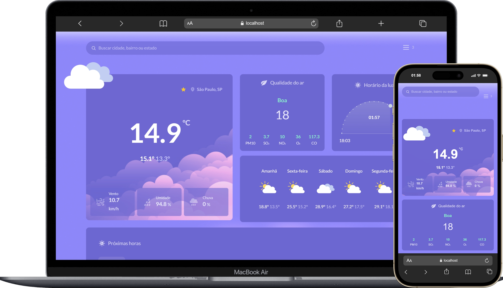

# 🌦️ Atmos


> **Consulta de condições climáticas em tempo real, com previsão horária e semanal.**
>
> Aplicação Angular com SSR que permite buscar o clima de qualquer cidade (nome, cidade/estado ou cidade/país), exibe as condições atuais, qualidade do ar, ciclo dia/noite, previsão horária e semanal, e permite favoritar locais — tudo consumindo a Visual Crossing Weather API através de um backend Express que protege as chaves de API do cliente.



---

## 📋 Sumário

- [Sobre o Projeto](#-sobre-o-projeto)
- [Funcionalidades](#-funcionalidades)
- [Arquitetura](#-arquitetura)
- [Tech Stack](#-tech-stack)
- [Como Executar](#-como-executar)
- [API](#-api)
- [Testes](#-testes)
- [Estrutura do Projeto](#-estrutura-do-projeto)
- [Documentação](#-documentação)
- [Contexto](#-contexto)

---

## 💡 Sobre o Projeto

O **Atmos** resolve o problema proposto no desafio técnico: dado um local informado pelo usuário, consultar e exibir de forma clara as condições climáticas atuais, a previsão horária e a previsão semanal, tratando erros de forma amigável.

A busca aceita nome de cidade, cidade e estado, ou cidade e país (ex: `São Paulo`, `Campinas, SP`, `Rio de Janeiro, Brasil`), com autocomplete via geocoding. Ao carregar, o app tenta localizar o usuário automaticamente (geolocalização do navegador, com fallback para São Paulo); a partir daí, os dados são atualizados automaticamente a cada 5 minutos, além de reagirem a qualquer nova busca ou seleção de favorito.

Toda chamada à Visual Crossing Weather API e à API de geocoding (Nominatim) passa por um backend Express embutido (via Angular SSR) — as chaves de API nunca são expostas ao navegador.

---

## ✨ Funcionalidades

| Requisito | Descrição | Status |
| :--- | :--- | :---: |
| **RF01 — Consulta por Local** | Busca por nome de cidade, cidade/estado ou cidade/país, com autocomplete e navegação por teclado | ✅ |
| **RF02 — Condições Atuais** | Temperatura atual, mínima/máxima do dia, sensação térmica, umidade, probabilidade de chuva e condição climática | ✅ |
| **RF03 — Previsão Horária** | Card com as próximas 12 horas (hora, temperatura, condição), completando com o dia seguinte à noite | ✅ |
| **RF04 — Atualizar Informações** | Reconsulta automática do local atual a cada 5 minutos, além de reagir a toda nova busca/seleção | ✅ |
| **RF05 — Tratamento de Erros** | Mensagens amigáveis para cidade não encontrada, falha de rede e campo vazio | ✅ |

Além dos requisitos obrigatórios, o projeto também inclui:

- **Qualidade do ar** (IQAr, calculado localmente a partir dos poluentes retornados pela API, seguindo a metodologia brasileira);
- **Ciclo dia/noite** (nascer/pôr do sol, com indicador de progresso);
- **Previsão semanal** (próximos 5 dias);
- **Favoritos** (persistidos em `localStorage`), com modal dedicado para consultar/remover.

---

## 🏗 Arquitetura

Angular com SSR, backend Express embutido que faz o proxy para as APIs externas, e uma pipeline de validação (Zod) + transformação (`class-transformer`) entre o payload cru e o componente.

📖 Diagramas completos (fluxo de carregamento, busca, polling, tratamento de erros) em **[`docs/ARCHITECTURE.md`](docs/ARCHITECTURE.md)**.

---

## 🚀 Tech Stack

| Camada | Tecnologia |
| :--- | :--- |
| **Frontend** | Angular 22 (standalone components, signals, zoneless), TypeScript, TailwindCSS 4 |
| **Backend (SSR)** | Express 5, embutido via `@angular/ssr` |
| **Validação** | Zod (schemas) + `class-transformer` (DTOs) |
| **Testes unitários** | Vitest 4 (via `@angular/build:unit-test`) |
| **Testes E2E** | Cypress 16 |
| **Containerização** | Docker (multi-stage) |
| **API de clima** | [Visual Crossing Weather API](https://www.visualcrossing.com/weather-api) |
| **API de geocoding** | Nominatim (OpenStreetMap) |

---

## ⚡ Como Executar

### Pré-requisitos

- Node.js 24+
- Uma chave de API da [Visual Crossing](https://www.visualcrossing.com/weather-api) (grátis, com limite de requisições)

### Localmente

1. **Clone o repositório e entre em `app/`:**

    ```bash
    git clone https://github.com/gusales/atmos.git
    cd atmos/app
    ```

2. **Instale as dependências:**

    ```bash
    npm install
    ```

3. **Configure as variáveis de ambiente** — copie `.env.example` para `.env` e preencha:

    ```bash
    cp .env.example .env
    ```

    ```
    WEATHER_API_URL=https://weather.visualcrossing.com/VisualCrossingWebServices/rest/services/timeline
    WEATHER_API_KEY=sua-chave-aqui
    GEOCODING_API_URL=https://nominatim.openstreetmap.org
    ```

4. **Rode em modo desenvolvimento:**

    ```bash
    npm start
    ```

    A aplicação fica disponível em `http://localhost:4200`.

5. **Ou rode o build de produção (SSR real):**

    ```bash
    npm run build
    npm run serve:ssr:app
    ```

    Disponível em `http://localhost:4000`.

### Com Docker

Como as variáveis de ambiente só são acessadas no lado do servidor, elas precisam ser passadas tanto no **build** (a rota principal é pré-renderada, e isso faz uma chamada real à API) quanto no **run**:

```bash
# build
source <(grep -v '^#' .env | sed 's/^/export /')
docker build -t atmos-app \
  --build-arg WEATHER_API_URL="$WEATHER_API_URL" \
  --build-arg WEATHER_API_KEY="$WEATHER_API_KEY" \
  --build-arg GEOCODING_API_URL="$GEOCODING_API_URL" \
  .

# run
docker run -d -p 4000:4000 --env-file .env -e NG_ALLOWED_HOSTS=localhost atmos-app
```

> `NG_ALLOWED_HOSTS` é a allowlist de hosts que o Angular SSR aceita no header `Host` (proteção contra Host header injection) — defina como o hostname real usado para acessar o container (`localhost` em dev, seu domínio em produção).

---

## 🔌 API

O frontend nunca chama a Visual Crossing/Nominatim diretamente — tudo passa pelo backend embutido (`GET /api/weather`, `GET /api/geocoding`, `GET /api/geocoding/coordinates`), que protege as chaves de API e normaliza erros upstream.

📖 Endpoints, exemplos de requisição/resposta e a atribuição exigida pela Nominatim em **[`docs/INTEGRATIONS.md`](docs/INTEGRATIONS.md)**.

```bash
curl "http://localhost:4000/api/weather?search=Barueri"
```

---

## 🧪 Testes

**199 testes unitários** (Vitest, 96.5% de cobertura) + **6 testes E2E** (Cypress, 3 specs) — nenhum deles depende de chave de API real ou internet.

```bash
npm test                 # unitários, com cobertura
npm run test:e2e          # e2e headless, estilo pipeline de CI
npm run test:e2e-ui       # e2e interativo, abre o navegador
```

📖 Convenções de mock, como cada suíte roda, e as pegadinhas encontradas (SSR/TransferState, Windows) em **[`docs/TESTING.md`](docs/TESTING.md)**.

---

## 📁 Estrutura do Projeto

```
atmos/
├── docs/
│   ├── ARCHITECTURE.md                         # Diagramas Mermaid do fluxo de dados
│   ├── INTEGRATIONS.md                         # Uso das APIs externas (Visual Crossing, Nominatim)
│   ├── TESTING.md                              # Como rodar/o que cobre cada suíte de teste
│   ├── DESAFIO.md                              # Enunciado do desafio técnico
│   ├── USO_DE_IA_NO_DESENVOLVIMENTO.md          # Registro do uso de IA no projeto
│   └── images/screenshot.png
├── .github/workflows/e2e.yml                    # CI dos testes E2E
└── app/
    ├── Dockerfile                               # Build multi-stage (SSR)
    ├── cypress.config.ts
    ├── cypress/{support,fixtures}/               # Comandos, stubs e fixtures do Cypress
    ├── test/e2e/                                 # Specs Cypress
    └── src/app/
        ├── core/
        │   ├── schemas/{weather,geocoding}/       # Validação Zod do payload cru
        │   ├── dtos/{weather,geocoding}/          # DTOs (class-transformer)
        │   └── services/{base,weather,geocoding,geolocation,favorites}/
        ├── components/                            # Componentes apresentacionais
        │   ├── current-weather/ air-quality/ sky-cicle/
        │   ├── weakly-forecast/ hourly-forecast/
        │   └── place-search/ favorites-modal/
        ├── features/weather-dashboard/            # Componente orquestrador
        ├── shared/{enums,types,errors,utils,abstracts,components/ui}/
        └── server/{controllers,routes,errors}/    # Backend Express (SSR)
```

---

## 📚 Documentação

| Documento | O que contém |
| :--- | :--- |
| [**Arquitetura**](docs/ARCHITECTURE.md) | Diagramas (Mermaid) do fluxo de dados, SSR/hidratação, busca, polling e tratamento de erros |
| [**Integrações**](docs/INTEGRATIONS.md) | Como a Visual Crossing e a Nominatim são consumidas, exemplos de requisição/resposta e a atribuição exigida |
| [**Testes**](docs/TESTING.md) | Como rodar e o que cobre cada suíte (unitária e E2E), convenções e pegadinhas encontradas |
| [**Desafio**](docs/DESAFIO.md) | O enunciado original do desafio técnico |
| [**Uso de IA no desenvolvimento**](docs/USO_DE_IA_NO_DESENVOLVIMENTO.md) | Registro de como o Claude Code foi usado ao longo do projeto |

---

## 🎓 Contexto

Projeto desenvolvido como resposta ao [desafio técnico para Front-end Júnior](docs/DESAFIO.md), cujo objetivo é avaliar consumo de APIs REST, estruturação de componentes, tratamento de estados e boas práticas de desenvolvimento. Além dos requisitos funcionais obrigatórios, o projeto foi ampliado com qualidade do ar, ciclo dia/noite, favoritos, testes automatizados (unitários e E2E) e containerização com Docker.
