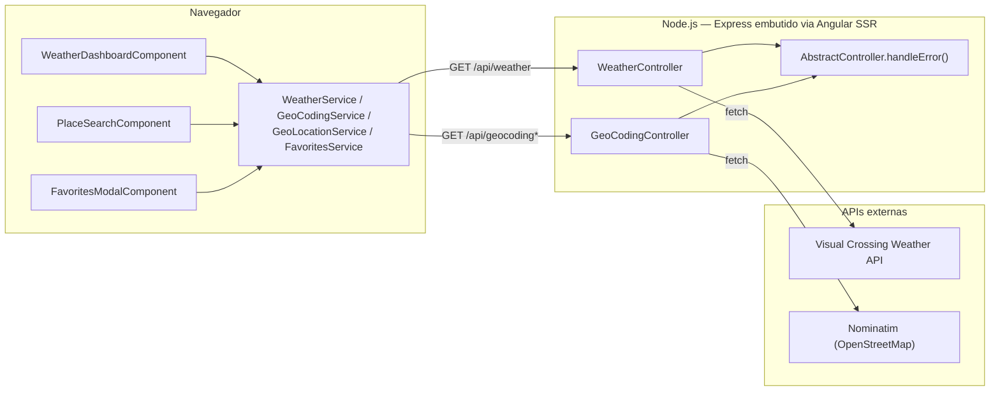
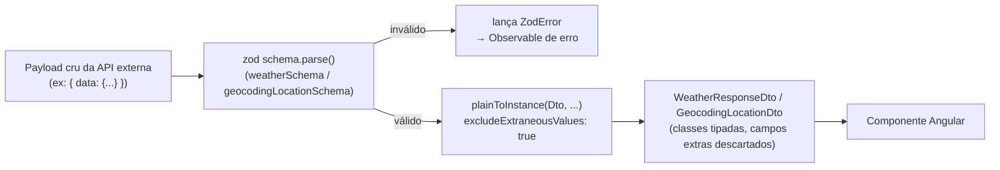
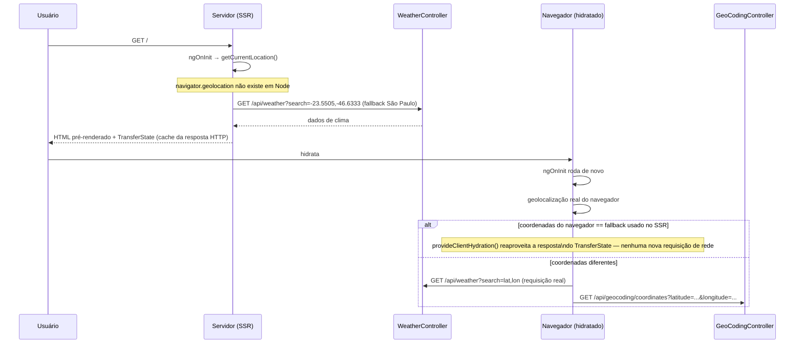
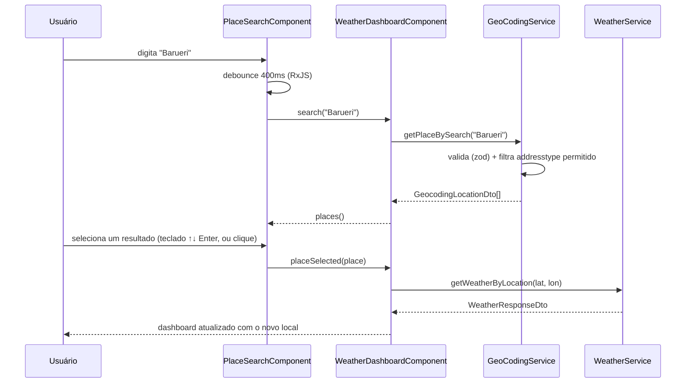
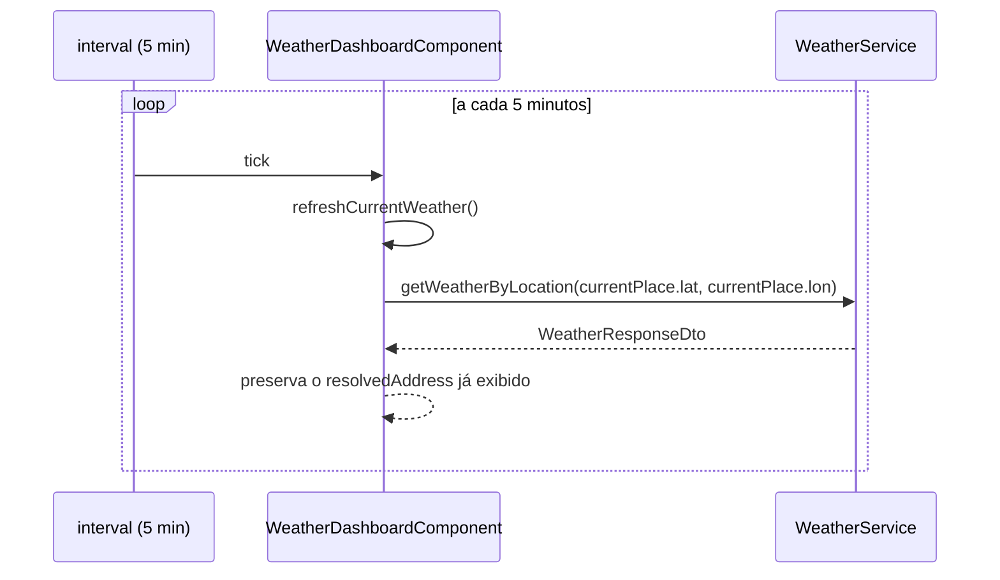
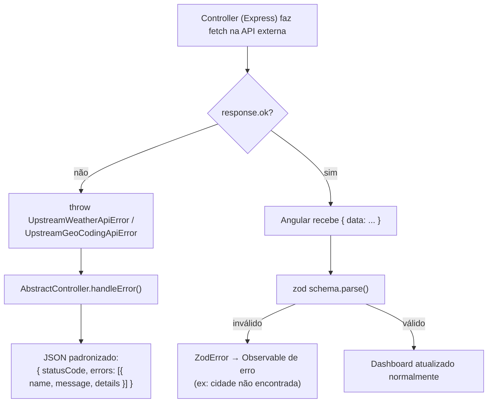
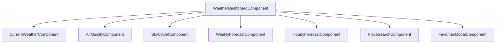

# Arquitetura

## Visão geral

O Atmos é uma aplicação Angular com SSR (Server-Side Rendering) via `@angular/ssr`. O mesmo processo Node roda tanto a renderização do Angular quanto um backend Express embutido, que atua como proxy entre o navegador e as APIs externas — o navegador nunca chama a Visual Crossing ou a Nominatim diretamente, e as chaves de API nunca saem do servidor.

## Camadas de dados: do payload cru ao componente

Toda resposta de API externa passa por duas etapas antes de chegar num componente: validação (Zod) e transformação (`class-transformer`). Isso isola o resto da aplicação de mudanças/inconsistências no formato retornado pelas APIs.

- Os **schemas Zod** (`core/schemas/*`) descrevem exatamente o que a API externa retorna, incluindo campos nulos (poluentes) e opcionais (campos de endereço).
- Os **DTOs** (`core/dtos/*`, com `@Expose()`) descrevem o que a aplicação realmente usa — qualquer campo não decorado é descartado no `plainToInstance`, mesmo que a API externa o retorne.

## Fluxo de carregamento inicial (SSR + hidratação)

A rota principal (`'**'`) é pré-renderada (`RenderMode.Prerender`). Isso significa que o `ngOnInit()` do dashboard roda **duas vezes**: uma no servidor (durante o SSR) e outra no navegador (durante a hidratação).

> Esse comportamento (`TransferState`/`HttpTransferCache` do Angular) é transparente em produção, mas é a razão pela qual os testes E2E estubam a geolocalização com coordenadas **diferentes** do fallback padrão — veja [`TESTING.md`](TESTING.md#stub-de-geolocalização).

## Fluxo de busca por local (RF01)

## Atualização automática (RF04) e favoritos

O polling reaproveita o `currentPlace` já resolvido (geolocalização, busca ou favorito) — não repete geocoding, só reconsulta o clima. A subscrição usa `takeUntilDestroyed()`, então é automaticamente cancelada quando o componente é destruído.

Favoritos são persistidos em `localStorage` via `FavoritesService` (client-only, não passa pelo servidor) — um `effect()` grava a lista a cada mudança do signal `favorites`.

## Tratamento de erros (RF05)

Erros de campo vazio são tratados no próprio `PlaceSearchComponent` (não dispara busca para string vazia); erros de rede/cidade não encontrada chegam como falha do Observable e são exibidos ao usuário de forma amigável.

## Componentes: orquestrador vs. apresentacionais

Só o `WeatherDashboardComponent` tem estado e injeta services — todos os outros são "burros" (`@Input()`/`@Output()`, sem injeção de service):

Isso mantém a lógica de negócio (cálculo de previsão semanal/horária, ciclo dia/noite, favoritos) centralizada em `computed()`s do dashboard, e os componentes filhos puramente de apresentação — fáceis de testar isoladamente (ver [`TESTING.md`](TESTING.md)).
